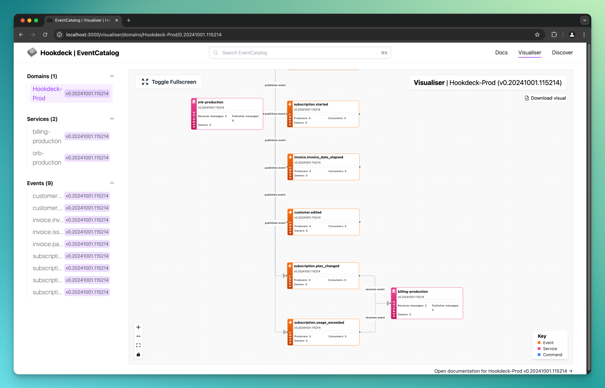

# Hookdeck EventCatalog Generator

Generated the following from a [Hookdeck](https://hookdeck.com?ref=github-hookdeck-eventcatalog-generator) Project:

- Services: based on Hookdeck [Sources](https://hookdeck.com/docs/sources?ref=github-hookdeck-eventcatalog-generator) and [Destinations](https://hookdeck.com/docs/destinations?ref=github-hookdeck-eventcatalog-generator)
- Events: based on Hookdeck [Requests](https://hookdeck.com/docs/requests?ref=github-hookdeck-eventcatalog-generator) to Sources and [Events](https://hookdeck.com/docs/events?ref=github-hookdeck-eventcatalog-generator) sent to Destinations



## Run the generator as a CLI

```sh
npx @hookdeck/eventcatalog-generator {flags}
```

Supported flags are:

- `log-level`: The level to log at - "fatal" | "error" | "warn" | "info" | "debug" | "trace"
- `match`: Regular expression match for Source names on Connections
- `dir`: Path the the Event Catalog install directory
- `api-key`: Hookdeck Project API Key
- `max-events`: The maximum number of Requests/Events to process per Source/Destination

Example:

```sh
npx @hookdeck/eventcatalog-generator \
    --dir ./path/to/eventcatalog/install \
    --api-key {HOOKDECK_API_KEY} \
    --log-level debug \
    --match "stripe-production" \
    --domain Payments \
    --max-events 200
```

The CLI will also use the following environment variables:

- `PROJECT_DIR`: Path the the Event Catalog install directory
- `HOOKDECK_PROJECT_API_KEY`: Hookdeck Project API Key

The environment variables can be within a `.env` file that will automatically be detected.

## Install the Hookdeck Generator in EventCatalog

Navigate to your EventCatalog directory, then install the package.

```sh
npm i @hookdeck/eventcatalog-generator
```

Configure your EventCatalog to use your generator

Edit your `eventcatalog.config.js` file and add the generator

```js
...
generators: [
    [
        "@hookdeck/eventcatalog-generator",
        {
            logLevel: "fatal" | "error" | "warn" | "info" | "debug" | "trace",
            connectionSourcedMatch: "regular expression string to match source names",
            hookdeckApiKey: "Hookdeck Project API Key. Hookdeck -> Project -> Settings -> Secrets"
        }
    ]
]
...
```

### Run the generator in Event Catalog

In the EventCatalog directory run:

```
npm run generate
```

This will run the generator code and interact with your Catalog.

## Development

### Run the generation

```sh
npm run generate -- {flags}
```

Supported flags are:

- `log-level`: The level to log at - "fatal" | "error" | "warn" | "info" | "debug" | "trace"
- `match`: Regular expression match for Source names on Connections
- `dir`: Path the the Event Catalog install directory
- `api-key`: Hookdeck Project API Key
- `max-events`: The maximum number of Requests/Events to process per Source/Destination

Example:

```sh
npm run generate -- --log-level debug --match "stripe-production" --domain Payments
```

The `generate` script will also use the following environment variables:

- `PROJECT_DIR`: Path the the Event Catalog install directory
- `HOOKDECK_PROJECT_API_KEY`: Hookdeck Project API Key

The environment variables can be within a `.env` file that will automatically be detected.

### Compile and watch your plugin

In the plugin directory run:

```sh
# Just build the plugin once
npm run build

# Watch changes (recommended for dev)
npm run build -- -- watch
```

---

## Resources

### Hookdeck

- [Hookdeck](https://hookdeck.com?ref=github-hookdeck-eventcatalog-generator)
- [Hookdeck docs](https://hookdeck.com/docs?ref=github-hookdeck-eventcatalog-generator)

### EventCatalog

- [eventcatalog.dev](https://eventcatalog.dev)
- [EventCatalog integrations](https://www.eventcatalog.dev/integrations)
- [EventCatalog Discord](https://discord.gg/3rjaZMmrAm)
